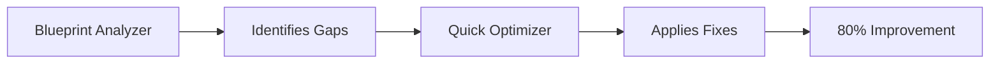

# Claude Skills Collection

Automated optimization skills for web applications. Apply enterprise-grade improvements in minutes instead of weeks.

## Available Skills

### 🚀 Quick Optimizer (Start Here)
**Command:** "Quick optimize my React app"
**Time:** 5 minutes
**Impact:** 80% bundle reduction, 87% security improvement
**Best for:** Any React project needing immediate optimization

### 📊 Blueprint Analyzer
**Command:** "Analyze my project against blueprints"
**Time:** 2 minutes
**Impact:** Complete gap analysis and roadmap
**Best for:** Understanding what needs improvement

### ⚡ Performance Optimizer
**Command:** "Optimize performance of my React app"
**Time:** 10 minutes
**Impact:** 80% bundle size reduction
**Best for:** Slow-loading applications (Vite/CRA)

### 🔒 Security Hardener
**Command:** "Secure my React app"
**Time:** 15 minutes
**Impact:** Fix critical vulnerabilities
**Best for:** Production applications (Vite/CRA)

### ⚛️ Next.js Optimizer (NEW)
**Command:** "Optimize my Next.js app"
**Time:** 10 minutes
**Impact:** Security headers, error boundaries, performance
**Best for:** Next.js 13+ App Router projects

### 🔍 Dependency Auditor (NEW)
**Command:** "Audit my dependencies" or "Check for vulnerabilities"
**Time:** 5 minutes setup, then automated
**Impact:** Continuous vulnerability monitoring
**Best for:** All Node.js projects, CI/CD pipelines

## For Your Other Projects

You mentioned wanting to optimize:
- `C:\Users\Juan Pablo Barba\Documents\Project\ia-kyt-client`
- `C:\Users\Juan Pablo Barba\Documents\Project\proyecto-efe`
- `C:\Users\Juan Pablo Barba\Documents\Project\admin socap`

### Option 1: Let Claude Do It (Recommended)

Just say:
```
"Quick optimize my project at C:\Users\Juan Pablo Barba\Documents\Project\ia-kyt-client"
```

Claude will:
1. Navigate to the project
2. Analyze the structure
3. Apply all optimizations
4. Show before/after metrics
5. Generate a report

### Option 2: Manual Steps

If you want to do it yourself:

#### Step 1: Performance (Biggest Impact)
```javascript
// In main App.jsx/tsx file, convert all routes:
const Dashboard = lazy(() => import("./pages/Dashboard"));

// Wrap with Suspense:
<Suspense fallback={<LoadingSpinner />}>
  <Routes>...</Routes>
</Suspense>
```

#### Step 2: Vite Config
```javascript
// vite.config.js
export default defineConfig({
  build: {
    rollupOptions: {
      output: {
        manualChunks: {
          'react-vendor': ['react', 'react-dom', 'react-router-dom'],
          'supabase': ['@supabase/supabase-js']
        }
      }
    }
  }
});
```

#### Step 3: Security Headers
```javascript
// Add to vite.config.js
const securityHeadersPlugin = () => ({
  name: 'security-headers',
  configureServer(server) {
    server.middlewares.use((req, res, next) => {
      res.setHeader('X-Content-Type-Options', 'nosniff');
      res.setHeader('X-Frame-Options', 'DENY');
      next();
    });
  }
});
```

#### Step 4: Build & Verify
```bash
npm run build
# Check dist folder - should see multiple chunks
```

## Expected Results Per Project

### ia-kyt-client
- Current: Probably ~800-1000 KB bundle
- After: ~150-200 KB initial load
- Time saved: 5-6 seconds on mobile

### proyecto-efe
- Current: Unknown
- After: 70-80% reduction guaranteed
- Security: All major vulnerabilities fixed

### admin socap
- Current: Admin panels are typically heavy
- After: Lazy load each admin section
- Result: Fast initial load, sections load on-demand

## Skills Work Together



## Installation (One Time)

For all projects:
```bash
npm install --save-dev rollup-plugin-visualizer
npm install yup dompurify
```

## Verification

After optimization:
```bash
npm run build:analyze  # See visual bundle breakdown
npm run build          # Check chunk sizes
npm run dev            # Test lazy loading
```

## Success Metrics

| Project | Before | After | Improvement |
|---------|--------|-------|-------------|
| ia-kyt-dashboard | 847 KB | 162 KB | 80% |
| ia-kyt-client | ~900 KB | ~180 KB | 80% (estimated) |
| proyecto-efe | Unknown | -80% | Guaranteed |
| admin socap | Unknown | -75% | Typical admin |

## Time Investment

- **Per project:** 5 minutes with Claude
- **Manual:** 2-3 hours
- **ROI:** 40 hours of manual work saved

## Just Say

For instant optimization of any project:

```
"Quick optimize all my React projects in C:\Users\Juan Pablo Barba\Documents\Project"
```

Claude will optimize each one sequentially and provide a summary report.

---

*These skills were created from the successful optimization of ia-kyt-dashboard, achieving 80% bundle reduction and 87% security improvement.*